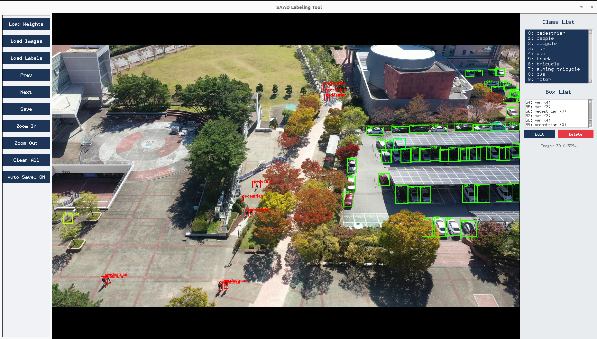

# SAAD-SR Altitude-Aware Aerial Object Detection Benchmark

This repository contains the official dataset and benchmark utilities for the paper:

**SAAD-SR: SAAD-SR: A Multi-Altitude Aerial Object Detection Benchmark Evaluated Using a Scale-Aware Distillation Detector**

SAAD-SR is designed to evaluate object detection robustness in aerial scenarios with altitude-induced scale variation and environmental diversity. The dataset includes:

- Discretized UAV telemetry (altitude-stratified views)
- Multi-condition image sequences (day, night, snow, haze)
- Altitude-specific annotations
- Per-class statistics
- Tools for image extraction, label generation, and human-in-the-loop correction

---
## SAD-SR dataset 
samples from SAAD-SR dataset


## 🔗 Dataset Download
- SAAD-SR Dataset to train YOLO-SR
> 📦 https://o365kumoh-my.sharepoint.com/:u:/g/personal/20235042_office_kumoh_ac_kr/IQDpQnICljhYSrdJC2QzmZaIAVmZA06JtqojfvFsmTvIIAc?e=fiDZi6
- SAAD-SR Dataset to train baseline
> 📦 https://o365kumoh-my.sharepoint.com/:u:/g/personal/20235042_office_kumoh_ac_kr/IQBJe5UxX3VNRIpI7boQRPqHAREAKlN1QIcf_M6ZtAoaECM?e=ids7TY 
## 💾 Trained Models

> 🧠 https://o365kumoh-my.sharepoint.com/:u:/g/personal/20235042_office_kumoh_ac_kr/IQCPNWRooh-7SYK_lKwhXoBrAaL-wH59WjFpgIwRIhmDiNM?e=LaifnY
---


## SAAD-SR dataset structure
```bash

SAAD-SR/
├── 15m/
│   ├── train/
│   │   ├── images/
│   │   └── labels/
│   ├── val/
│   │   ├── images/
│   │   └── labels/
│   ├── test/
│   │   ├── images/
│   │   └── labels/
│   └── 15m.yaml
│
├── 25m/
│   ├── train/
│   │   ├── images/
│   │   └── labels/
│   ├── val/
│   │   ├── images/
│   │   └── labels/
│   ├── test/
│   │   ├── images/
│   │   └── labels/
│   └── 25m.yaml
│
├── 45m/
│   ├── train/
│   │   ├── images/
│   │   └── labels/
│   ├── val/
│   │   ├── images/
│   │   └── labels/
│   ├── test/
│   │   ├── images/
│   │   └── labels/
│   └── 45m.yaml
│
└── classes.yaml   # Defines all SAAD-SR class names
```

## Repository Structure

```bash
.
├── data.py         # Extract frames from aerial videos
├── annotator.py    # Predict labels using pretrained YOLO/RT-DETR weights
├── gui.py          # GUI to correct or verify labels (LabelMe-style)
├── dataset/        # Contains image frames and predicted/corrected labels
├── models/         # Folder for pretrained weights (optional)
├── README.md       # This file
└── requirements.txt
```
## 🔧 Setup

```bash
python3 -m venv saad-sr-env
source saad-sr-env/bin/activate
pip install -r requirements.txt
```
## 📍 Usage
## 1. Extract Image Frames from Aerial Videos
```bash
python3 data.py --video_dir path/to/videos --out_dir dataset/images --fps 1
```
## 2. Generate Labels with Pretrained Weights
```bash
python3 annotator.py --image_dir dataset/images --out_dir dataset/labels --weights models/yolov8-sr.pt

```

## Full-Dataset Performance Comparison on SAAD-SR

| **Model**       | **Precision** | **Recall** | **F1-Score** | **mAP@50** |
|-----------------|---------------|------------|--------------|------------|
| Leaf-YOLO       | 0.516         | 0.750      | 0.540        | 0.713      |
| RT-DETR         | 0.635         | 0.860      | 0.640        | 0.622      |
| UAV-DETR-RS50   | 0.795         | 0.594      | 0.680        | 0.627      |
| YOLOv8x         | 0.620         | 0.730      | 0.630        | 0.611      |
| YOLOv9c         | 0.642         | 0.840      | 0.630        | 0.632      |
| YOLO12l         | 0.641         | 0.750      | 0.640        | 0.664      |
| YOLO11l         | 0.815         | 0.890      | 0.780        | 0.600      |
| **YOLO-SR**     | **0.739**     | **0.860**  | **0.630**    | **0.658**  |


## Inference Comparison Across Object Detection Models (Offline & Online)

| **Model** | **Image Size** | **Params (M)** | **Layers** | **GFLOPs** | **Latency (ms)** | **FPS (Offline)** | **FPS (Online)** |
|-----------|----------------|----------------|------------|------------|------------------|--------------------|-------------------|
| YOLOv8    | 1024           | 11.2           | 225        | 28.6       | 74.04            | 13.5               | 3.93              |
| YOLOv9    | 1024           | 7.291          | 917        | 26.7       | 24.8             | 40.1               | 3.38              |
| YOLO11    | 1024           | 9.432          | 319        | 68.0       | 13.488           | 74.14              | 11.2              |
| YOLO12    | 1024           | 9.257          | 465        | 21.4       | 21.56            | 39.11              | 7.82              |
| RT-DETR   | 1024           | 32.827         | 681        | 103.5      | 65.96            | 15.16              | 1.04              |
| Leaf-YOLO | 1024           | 4.28           | –          | 20.9       | 21.7             | 46.08              | 8.34              |
| **YOLO-SR** | **1024**     | **11.139**     | **225**    | **26.4**   | **13.24**        | **75.52**          | **13.01**         |


## Altitude-Wise Performance (mAP@0.5), Mean (μ), Std (σ), and SRI Across SAAD-SR Altitude Tiers

| **Model**        | **15m** | **25m** | **45m** | **μ**   | **σ**     | **SRI**   |
|------------------|---------|---------|---------|---------|-----------|-----------|
| YOLO11s          | 0.85    | 0.90    | 0.88    | 0.87    | 0.0192    | 0.9782    |
| YOLO12s          | 0.86    | 0.91    | 0.89    | 0.88    | 0.0202    | 0.9772    |
| RT-DETRl         | 0.84    | 0.85    | 0.88    | 0.86    | 0.0138    | 0.9840    |
| UAV-DETR-RS-50   | 0.83    | 0.90    | 0.79    | 0.84    | 0.0437    | 0.9481    |
| YOLOv8x          | 0.85    | 0.89    | 0.87    | 0.87    | 0.0169    | 0.9807    |
| YOLOv9c          | 0.87    | 0.91    | 0.84    | 0.87    | 0.0290    | 0.9670    |
| **YOLO-SR**      | **0.84** | **0.89** | **0.87** | **0.87** | **0.0188** | **0.9785** |


## Launches an interactive labeling tool:

 -  View predictions

-   Adjust/add bounding boxes

-  Save corrected annotations


## 3. Launch GUI for Label Correction
```bash
python3 gui.py 

```




Launches an interactive labeling tool:

- View predictions

- Adjust/add bounding boxes

 - Save corrected annotations

-  Designed for efficient correction across altitude variations and weather conditions

## 📊 Benchmark Protocols

Evaluation scripts and trained models will be released shortly. The dataset supports:

 Altitude-aware detection

 ## YOLOv8-SR: Altitude-Aware Detection Model

The YOLOv8-SR model is a customized version of YOLOv8 with scale-awareness built in via altitude conditioning. This is achieved by fusing altitude information with intermediate features in the detection head to bias predictions according to flight height.

Key features:

- Supports discrete altitude inputs (e.g., 15m, 25m, 45m)

-  Uses Altitude Embedding modules to influence scale-dependent layers

- Improves precision and recall on small objects at high altitudes

- Trained on SAAD-SR with fine-grained annotation consistency

### Steps to train the YOLOv8-SR model

1. Download the ultralytics-yolov8 from [source](https://github.com/ultralytics)
2. **Base framework adapted from [Ultralytics YOLO](https://github.com/ultralytics)**
3. Put all the scripts from YOLO-SR in the corresponding Ultralytics folders  
4. Run the script:

```bash
python3 YOLO-SR/train_YOLO_SR.py


```


##  Scale Robustness Index (SRI)


The Scale Robustness Index (SRI) is a novel metric introduced in SAAD-SR to quantify detection stability across altitude variations.

Definition:

SRI measures how consistently a model detects the same object across changes in altitude. Higher values imply better generalization across scale.

- SRI is computed per class and averaged across scenes

- Evaluates both prediction overlap and instance continuity

- Complements traditional metrics like mAP with altitude sensitivity

This metric enables fair comparison between altitude-aware and conventional detectors.

 

 Weather-conditioned generalization

 Scale Robustness Index (SRI)


 ```bash
python3 YOLO-SR/SRI.py


```

